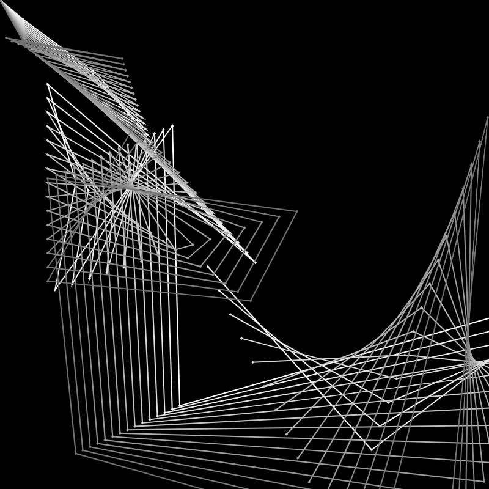
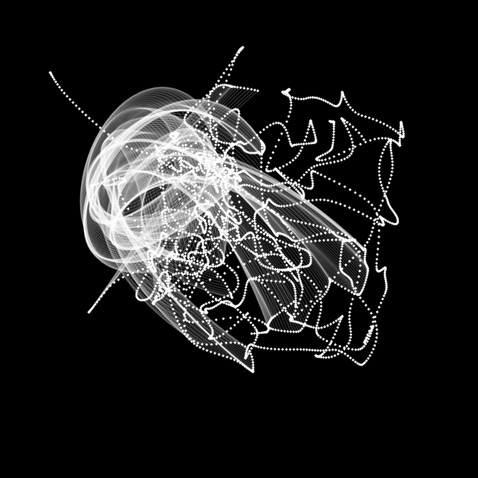
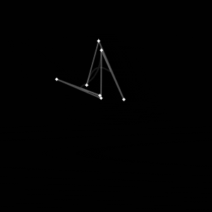
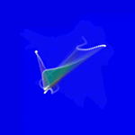
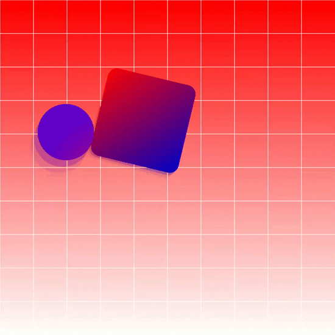
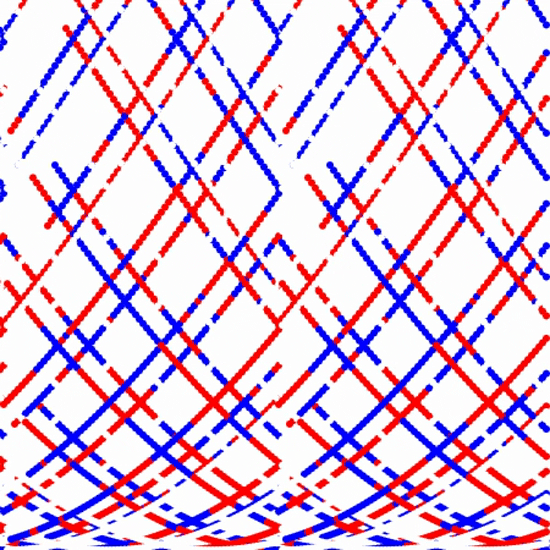
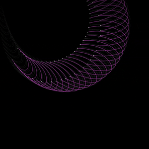
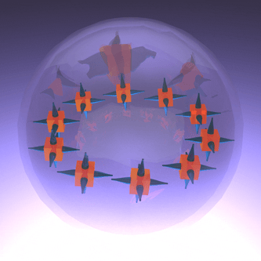

# Daily Sketches

Trying to get into the habit of writing some daily visuals in code.
Many of the sketches use a [typed version of p5.js](https://github.com/l00sed/p5js-boilerplate-ts).
There are also some sketches that use [a three.js boilerplate](https://github.com/l00sed/threejs-boilerplate).
If you're an artist or creative technologist, you might be interested in using the linked repos.
It's helped me familiarize myself with the available commands and techniques.
Using the boilerplates reduces the amount of friction it takes to actually dive into the code and design.
I've also been using Grasshopper 3D to produce some interesting scripts for generative 3D models and animations.

## Gallery

