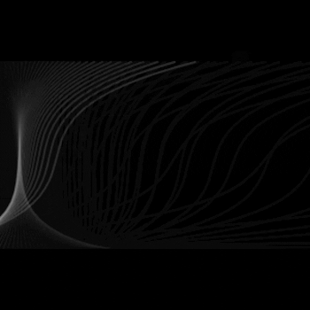
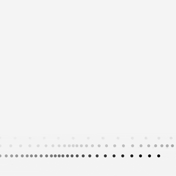

# Daily Sketches

Trying to get into the habit of writing some daily p5 sketches to get better at typescript and to eventually use the p5 library with less friction by familiarizing myself with the available commands and techniques.

